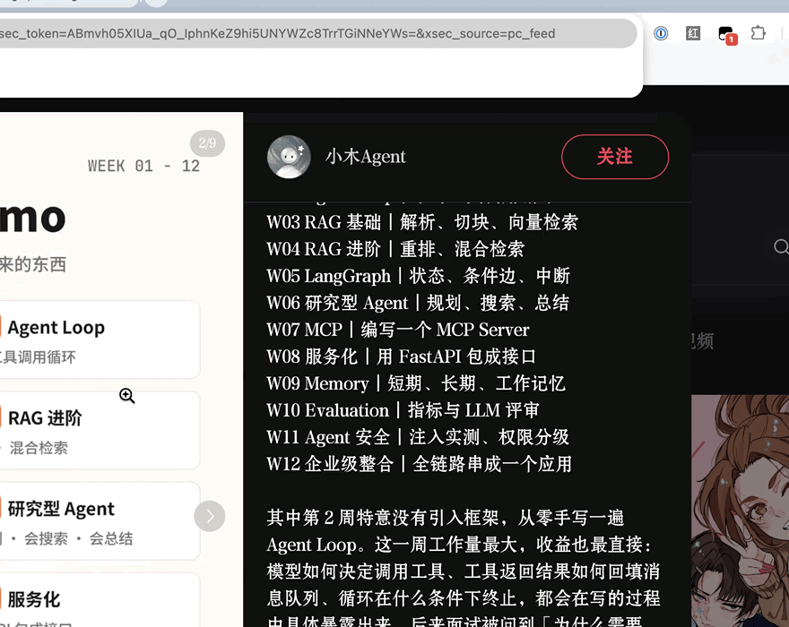

# 红薯收藏夹

**把小红书网页版的原图、GIF 和实况照片，直接存进 Mac「照片」App。**

[中文](#中文) · [English](#english)



预览、勾选、一键导入。导入后经 iCloud 照片自动同步到 iPhone 和其他 Apple 设备。

---

# 中文

## 这是什么

一个 Chrome 扩展 + 本机连接器。在小红书网页版打开一篇图文笔记，扩展会列出页面里的全部图片，你勾选需要的，它们就被下载并写入 macOS「照片」。

它解决的是网页版小红书最麻烦的几件事：

- **拿到的是缩略图，不是原图。** 连接器会剥离 CDN 的缩放、格式转换和水印后缀，回源下载原始上传文件。
- **GIF 被转成了静态图。** 这里按文件真实内容判断格式，GIF 保持动图。
- **实况照片存下来只剩一张封面。** 连接器会同时取回静态帧与短视频，写入相同的 Apple Content Identifier 后作为配对资源导入，「照片」里就是能按下去的实况照片。

没有远程服务器，没有账号，没有遥测。所有处理都在你自己的 Mac 上完成。

## 工作方式

Chrome 扩展不能直接写入 macOS 照片图库，所以走 Chrome 官方的 Native Messaging：

```
扩展弹窗 → Native Messaging → 本机照片连接器 → Photos.app
```


连接器只接受来自本扩展固定 ID 的消息，只允许下载小红书及其图片 CDN 的地址。

| 组件 | 文件 | 职责 |
| --- | --- | --- |
| 扩展界面 | `popup.html` `popup.css` `popup.js` | 列出图片、勾选、触发导入 |
| 内容脚本 | `content.js` | 解析笔记页，提取图片与实况视频地址 |
| 本机连接器 | `native-host/host.py` | 校验来源、回源下载、嗅探格式、导入「照片」 |
| 实况配对 | `native-host/live-photo-helper.swift` | 为静态帧与 MOV 写入同一 Content Identifier |
| 纯快捷指令版 | `ios-shortcut/` | 不装任何东西，用 iPhone 快捷指令存图 |

## 安装

需要 macOS、Chrome 109+、Python 3。

1. 在 Finder 中打开项目的 `native-host` 文件夹。
2. 右键 `install.command`，选择「打开」，确认运行。
3. 在 Chrome 地址栏打开 `chrome://extensions`。
4. 如果列表里已有旧版「红薯收藏夹」，先移除它。然后点「加载已解压的扩展程序」，选择本项目文件夹。
5. 确认扩展 ID 是 `doklnnbjpnipnicbiecefbchkhmckcbm`。

安装脚本会把连接器复制到 `~/Library/Application Support/红薯收藏夹/`，用 `swiftc` 现场编译实况照片组件，并注册 Native Messaging 清单。

> **升级提示：** 旧版扩展没有固定 ID，仅点刷新可能匹配不上已安装的连接器，所以这次升级需要移除后重新加载。以后更新只需刷新扩展。

第一次导入时，macOS 会询问 Chrome 是否可以控制「照片」，选择**允许**。之后不再需要运行安装程序。

## 使用

1. 在网页版小红书打开一篇图文笔记，**等待图片加载完成**。
2. 点击工具栏上的「红薯收藏夹」。
3. 勾选需要的图片（默认全选），点「导入 N 张」。

导入完成后会提示成功张数。如果某张失败，提示里会说明是哪一张、为什么。

**实况照片降级：** 如果某篇笔记没有向网页提供实况视频地址，那张图会作为**静态图**正常导入，并在结果中明确提示「N 张仅保存静态图」。部分旧笔记只返回静态封面，视频部分无法恢复。

单次最多导入 30 张，单张上限 80 MB。

## 权限说明

| 权限 | 用途 |
| --- | --- |
| `activeTab` | 点击扩展时读取当前标签页 |
| `scripting` | 在页面主世界注入读取脚本 |
| `nativeMessaging` | 把选中的图片 URL 交给本机连接器 |
| `host_permissions` | 仅限 `*.xiaohongshu.com`、`*.xhscdn.com`、`*.xhscdn.net` |

连接器侧另有一层独立的域名白名单校验，扩展被篡改也无法让它去下载别处的文件。

## 常见问题

**提示「尚未安装照片连接器」或 Native host not found**
重新运行 `native-host/install.command`，确认扩展 ID 与上文一致，然后重启 Chrome。

**只找到封面**
先点开笔记详情并滑动图片让内容加载完成，再点弹窗右上角的刷新按钮。

**首次导入失败**
在「系统设置 → 隐私与安全性 → 自动化」中，允许 Chrome 控制「照片」。

**出现重复图片确认**
这是「照片」App 自己的重复检测，选择跳过或导入都可以。

**实况照片变成了静态图**
先重新运行 `native-host/install.command`，再刷新扩展。若仍如此，多半是这篇笔记本身没有向网页返回视频地址。

## 纯快捷指令版（iPhone，无需安装）

不想装 App 也不想用 Mac？`ios-shortcut/` 里有一个纯快捷指令版本：复制小红书笔记链接，运行快捷指令，它能从「标题 + 短链 + 口令」的整段分享文案中提取 URL、跟随 `xhslink.com` 短链跳转、读取公开页面的图片列表，多选后直接存进 iPhone「照片」。

**能力边界：** 只支持普通图片和源页面返回的原始 GIF。实况照片只能保存静态封面——系统 Live Photo 是照片与配对视频组成的资源，纯快捷指令没有把它们配对导入的动作。完整的实况照片保存需要 Mac 端连接器。

安装说明见 [ios-shortcut/README.md](ios-shortcut/README.md)。

## 卸载

运行 `native-host/uninstall.command`。它会把连接器和清单文件移到废纸篓，**不会删除照片图库里的任何图片**。

## 致谢与许可

实现参考了两个 MIT 许可的项目：

- [FlyTOmeLight/x-photo-saver](https://github.com/FlyTOmeLight/x-photo-saver) — Native Messaging 架构、CDN URL 归一化策略、Referer 处理
- [RhetTbull/makelive](https://github.com/RhetTbull/makelive) — Live Photo Content Identifier 方案、ImageIO 与 AVFoundation 用法

完整许可文本见 [THIRD_PARTY_NOTICES.md](THIRD_PARTY_NOTICES.md)。

---

# English

**Save original photos, GIFs, and Live Photos from the Xiaohongshu (RED) web player straight into macOS Photos.**

Preview, tick the ones you want, import. iCloud Photos then syncs them to your iPhone and other Apple devices.

## What it is

A Chrome extension plus a local native-messaging host. Open a Xiaohongshu post in the web player, and the extension lists every image on the page. Tick what you want and they are downloaded and written into macOS Photos.

It fixes the three things that make the web player annoying:

- **You get thumbnails, not originals.** The host strips the CDN's resize, format-conversion, and watermark suffixes, then fetches the original uploaded file.
- **GIFs arrive as stills.** File format is decided by sniffing the actual bytes, so GIFs stay animated.
- **Live Photos lose their motion.** The host downloads both the still frame and the short video, stamps them with the same Apple Content Identifier, and imports them as a paired asset — a real, pressable Live Photo in your library.

No remote server, no account, no telemetry. Everything runs on your own Mac.

## How it works

A Chrome extension cannot write to the macOS photo library directly, so this uses Chrome's official Native Messaging:

```
Extension popup → Native Messaging → Local photo connector → Photos.app
```


The connector only accepts messages from this extension's fixed ID, and only downloads from Xiaohongshu and its image CDNs.

| Component | Files | Role |
| --- | --- | --- |
| Extension UI | `popup.html` `popup.css` `popup.js` | Lists images, handles selection, starts the import |
| Content script | `content.js` | Parses the post page, extracts image and Live Photo video URLs |
| Native host | `native-host/host.py` | Verifies origin, downloads originals, sniffs formats, imports to Photos |
| Live Photo pairing | `native-host/live-photo-helper.swift` | Writes one shared Content Identifier into the still and the MOV |
| Shortcuts-only build | `ios-shortcut/` | Save images from an iPhone Shortcut with nothing installed |

## Installation

Requires macOS, Chrome 109+, and Python 3.

1. Open the project's `native-host` folder in Finder.
2. Right-click `install.command`, choose **Open**, and confirm.
3. Open `chrome://extensions` in Chrome.
4. If an older "红薯收藏夹" is already listed, remove it first. Then click **Load unpacked** and select the project folder.
5. Confirm the extension ID is `doklnnbjpnipnicbiecefbchkhmckcbm`.

The installer copies the host to `~/Library/Application Support/红薯收藏夹/`, compiles the Live Photo helper on the spot with `swiftc`, and registers the Native Messaging manifest.

> **Upgrading:** the older extension had no fixed ID, so a plain refresh may not match the installed host. This one upgrade needs a remove-and-reload. Future updates are just a refresh.

On the first import, macOS asks whether Chrome may control Photos — choose **Allow**. You will not need to run the installer again.

## Usage

1. Open a post in the Xiaohongshu web player and **wait for the images to finish loading**.
2. Click **红薯收藏夹** in the toolbar.
3. Tick the images you want (all are selected by default) and click **Import N**.

You will be told how many succeeded. If one fails, the message names which one and why.

**Live Photo fallback:** if a post never exposes its Live Photo video URL to the page, the still is imported normally as a static photo and the result explicitly says "N saved as still only". Some older posts only serve a static cover, and the missing video cannot be recovered.

Up to 30 images per import, 80 MB per image.

## Permissions

| Permission | Why |
| --- | --- |
| `activeTab` | Read the current tab when you click the extension |
| `scripting` | Inject the read script into the page's main world |
| `nativeMessaging` | Hand the selected image URLs to the local connector |
| `host_permissions` | Limited to `*.xiaohongshu.com`, `*.xhscdn.com`, `*.xhscdn.net` |

The host enforces its own independent hostname allowlist, so even a tampered extension cannot make it fetch files from anywhere else.

## Troubleshooting

**"Connector not installed" / Native host not found**
Re-run `native-host/install.command`, confirm the extension ID matches the one above, then restart Chrome.

**Only the cover image is found**
Open the post detail and scroll through the images so the content loads, then click the refresh button at the top right of the popup.

**First import fails**
In System Settings → Privacy & Security → Automation, allow Chrome to control Photos.

**A duplicate-photo prompt appears**
That is Photos' own duplicate detection. Skip or import — either is fine.

**A Live Photo was saved as a still**
Re-run `native-host/install.command` and refresh the extension. If it persists, that post likely never served a video URL to the page.

## Shortcuts-only build (iPhone, nothing to install)

Prefer not to use a Mac? `ios-shortcut/` contains a pure Shortcuts version: copy a Xiaohongshu post link, run the shortcut, and it pulls the URL out of a full share blob ("title + short link + code"), follows the `xhslink.com` redirect, reads the public page's image list, and saves your selection to iPhone Photos.

**Limits:** plain images and original GIFs only. Live Photos save as a static cover — a system Live Photo is a photo plus a paired video, and Shortcuts has no action to import them as a pair. Full Live Photo saving needs the Mac connector.

See [ios-shortcut/README.md](ios-shortcut/README.md) for setup.

## Uninstalling

Run `native-host/uninstall.command`. It moves the connector and its manifest to the Trash and **does not delete anything from your photo library**.

## Credits & License

Modelled on two MIT-licensed projects:

- [FlyTOmeLight/x-photo-saver](https://github.com/FlyTOmeLight/x-photo-saver) — Native Messaging architecture, CDN URL normalization, Referer handling
- [RhetTbull/makelive](https://github.com/RhetTbull/makelive) — Live Photo Content Identifier strategy, ImageIO and AVFoundation usage

Full license texts are in [THIRD_PARTY_NOTICES.md](THIRD_PARTY_NOTICES.md).

---

请只保存你有权使用的图片，并尊重作者版权和平台规则。
Please only save images you have the right to use, and respect creators' rights and platform rules.
